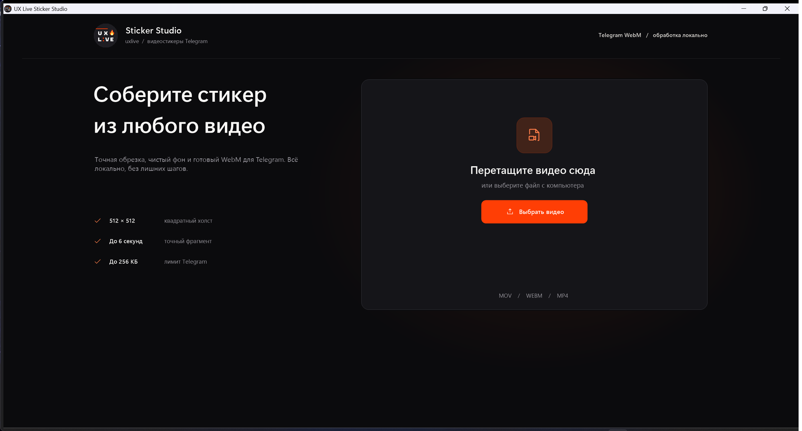
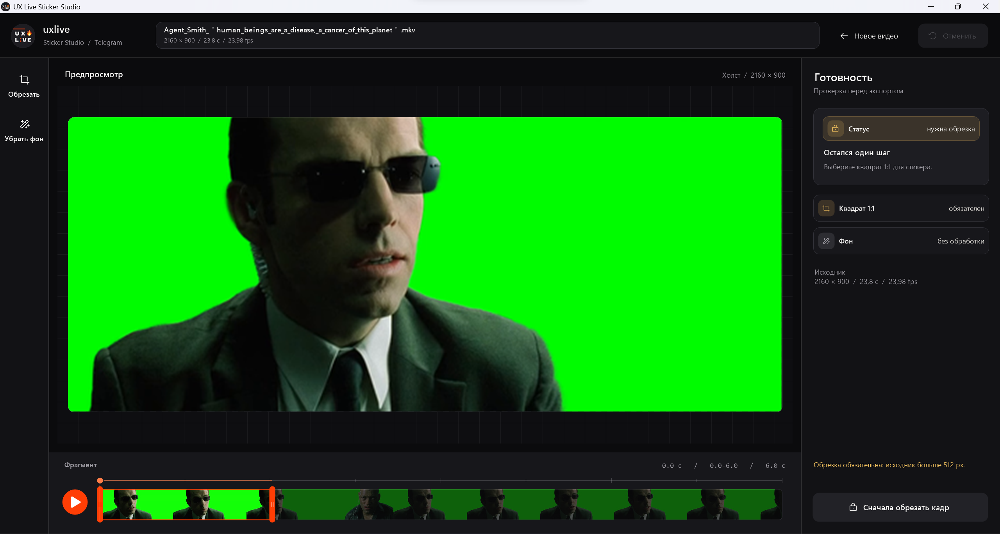

# uxlive Sticker Studio

Нативный Windows-редактор видеостикеров для Telegram. Обрезка, точный выбор фрагмента, удаление однотонного фона и экспорт в готовый WebM — локально, без Adobe, облака и командной строки.

Перетащите MOV, WebM или MP4, выберите квадратный кадр и фрагмент до 6 секунд. Sticker Studio соберёт стикер 512 × 512 без звука, сохранит прозрачность и автоматически уложит результат в лимит 256 КБ.





## Скачать

Актуальная версия — [**v1.1.0 в Releases**](../../releases/latest). Для запуска достаточно одного файла `StickerStudio-Standalone.exe` (~37 МБ): ffmpeg уже находится внутри, установка не нужна. Поддерживаются Windows 10 и 11.

При первом запуске SmartScreen может предупредить о неподписанном файле — «Подробнее → Выполнить в любом случае».

## Что нового в v1.1

- Полностью переработанный интерфейс uxlive: новая стартовая страница, рабочая область, инспектор готовности и аккуратная адаптация окна
- Чёткий предпросмотр 512 × 512 при воспроизведении и понятная индикация подготовки кадров прямо поверх превью
- Улучшенный хромакей: более гладкая альфа-кромка, подавление зелёного ореола и защита цвета на полупрозрачных пикселях
- Экспорт приведён к предпросмотру: те же параметры keying, crop и сглаживания используются в финальном VP9 WebM
- Новая система иконок, более точный таймлайн и исправленные состояния обработки, статуса и экспорта

## Возможности

- **Вход**: MOV, WebM с альфа-каналом или обычный MP4; исходник не покидает компьютер
- **Таймлайн-филмстрип**: точный отрезок от 0,5 до 6 секунд, увеличенная зона перетаскивания и зацикленный предпросмотр без звука
- **Обрезка 1:1**: итоговый холст 512 × 512, с точным позиционированием квадратного кадра
- **Удаление фона**: пипетка, Gain и Shrink/Grow, сглаживание края и despill; финальный WebM повторяет результат предпросмотра
- **Управление**: Пробел — play/pause, ←/→ — покадрово, Ctrl+O — новое видео, C — обрезка, B — фон, Ctrl+E — экспорт, Ctrl+Z — отмена
- **Умный fps**: частота исходника сохраняется; если выше 30 — программа предложит пересчитать (Telegram принимает до 30)
- **Экспорт**: VP9 WebM с прозрачностью, двухпроходный автоподбор битрейта под лимит 256 КБ

## Сборка из исходников

Нужен только Windows — компилятор `csc.exe` встроен в систему (.NET Framework 4.8), SDK не требуется.

```bat
cd src
build.cmd              — лёгкая версия (ffmpeg.exe должен лежать рядом с программой)
build-standalone.cmd   — всё-в-одном (сначала положите ffmpeg.exe в корень
                         проекта и запустите make-ffmpeg-gz.ps1)
```

ffmpeg можно взять на [gyan.dev](https://www.gyan.dev/ffmpeg/builds/) (сборка essentials, GPL).

## Как это работает

Telegram проверяет длительность видеостикера по полю Duration в контейнере WebM/EBML. После кодирования программа находит это поле (id `44 89`) и записывает валидное значение `1.0` — клиенты Telegram принимают такой стикер длиной до 6 секунд. Кодирование — libvpx-vp9 с `yuva420p` (альфа-канал), двухпроходное, с итеративным подбором битрейта под 256 КБ.

---

Сделано в [UX Live](https://t.me/uxlive) 🔥
