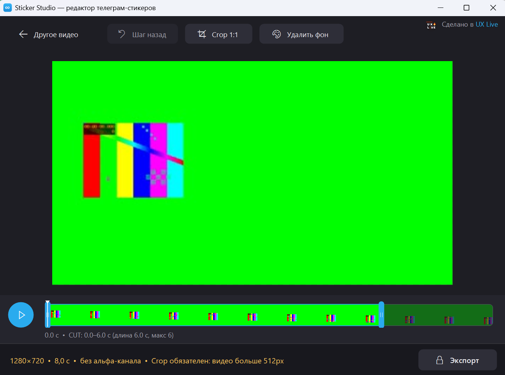

# Sticker Studio

Мини-редактор видеостикеров для Telegram — для всех, без Adobe и командной строки.

Кидаете видео → кроп 1:1, подрезка по времени, удаление зелёного фона → на выходе готовый стикер: WebM (VP9) ≤ 256 КБ, одна сторона 512px, без звука, **с обходом лимита «не длиннее 3 секунд»** (можно до 6).



## Скачать

Готовая программа — в [**Releases**](../../releases/latest): один файл `StickerStudio-Standalone.exe` (~36 МБ, внутри уже есть ffmpeg). Windows 10/11, установка не нужна.

При первом запуске SmartScreen может предупредить о неподписанном файле — «Подробнее → Выполнить в любом случае».

## Возможности

- **Вход**: `.mov` / `.webm` с альфа-каналом (прозрачность сохраняется) или обычный `.mp4`
- **Таймлайн-филмстрип** с CUT-рамкой: отрезок от 0,5 до 6 секунд, зацикленный предпросмотр без звука (Пробел — play/pause, ←/→ — покадрово)
- **Crop 1:1** — итог всегда 512×512 (для видео крупнее 512px кроп обязателен)
- **Удаление фона** — направленный хромакей в духе Keylight: пипетка, Gain, Shrink/Grow; превью = результат (WYSIWYG)
- **Умный fps**: частота исходника сохраняется; если выше 30 — программа предложит пересчитать (Telegram принимает до 30)
- **Undo** (Ctrl+Z) на каждое действие
- Автоподбор битрейта под лимит 256 КБ (двухпроходный VP9) + hex-патч длительности

## Сборка из исходников

Нужен только Windows — компилятор `csc.exe` встроен в систему (.NET Framework 4.8), SDK не требуется.

```bat
cd src
build.cmd              — лёгкая версия (ffmpeg.exe должен лежать рядом с программой)
build-standalone.cmd   — всё-в-одном (сначала положите ffmpeg.exe в корень
                         проекта и запустите make-ffmpeg-gz.ps1)
```

ffmpeg можно взять на [gyan.dev](https://www.gyan.dev/ffmpeg/builds/) (сборка essentials, GPL).

## Как это работает

Telegram проверяет длительность видеостикера по полю Duration в контейнере WebM/EBML. После кодирования программа находит это поле (id `44 89`) и записывает валидное значение `1.0` — клиенты Telegram принимают такой стикер длиной до 6 секунд. Кодирование — libvpx-vp9 с `yuva420p` (альфа-канал), двухпроходное, с итеративным подбором битрейта под 256 КБ.

---

Сделано в [UX Live](https://t.me/uxlive) 🔥
